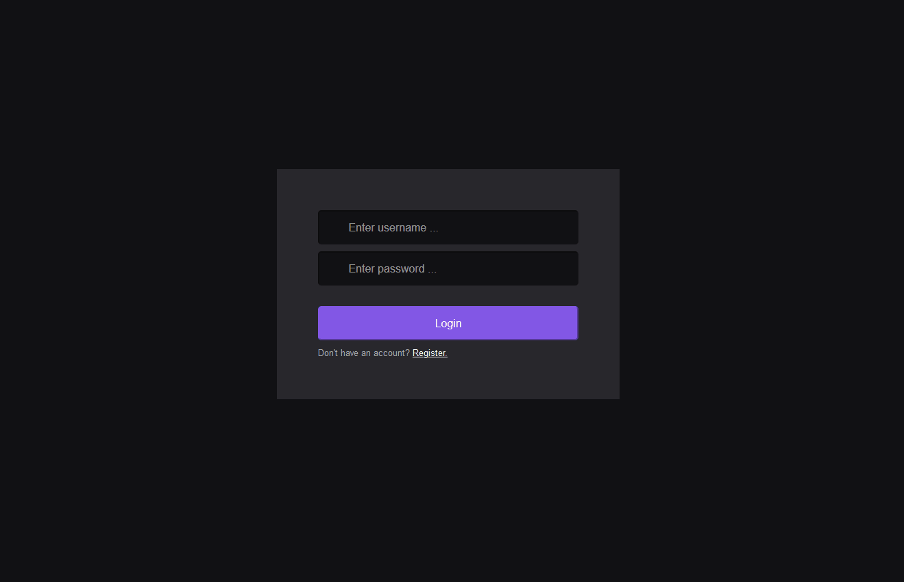

# Adopet

This is a React.js application where you can Register and Login as a User. Once logged in, you can perform CRUD Operations on clients. This App can be tested
along with this [API](https://github.com/leonardo-alm/API--Jwt-Authentication) 

## Demo

To see the demo in higher quality click on the gif below.

## Run

Run 'npm start' to run the app.

Open [http://localhost:3000](http://localhost:3000) to view it in the browser.